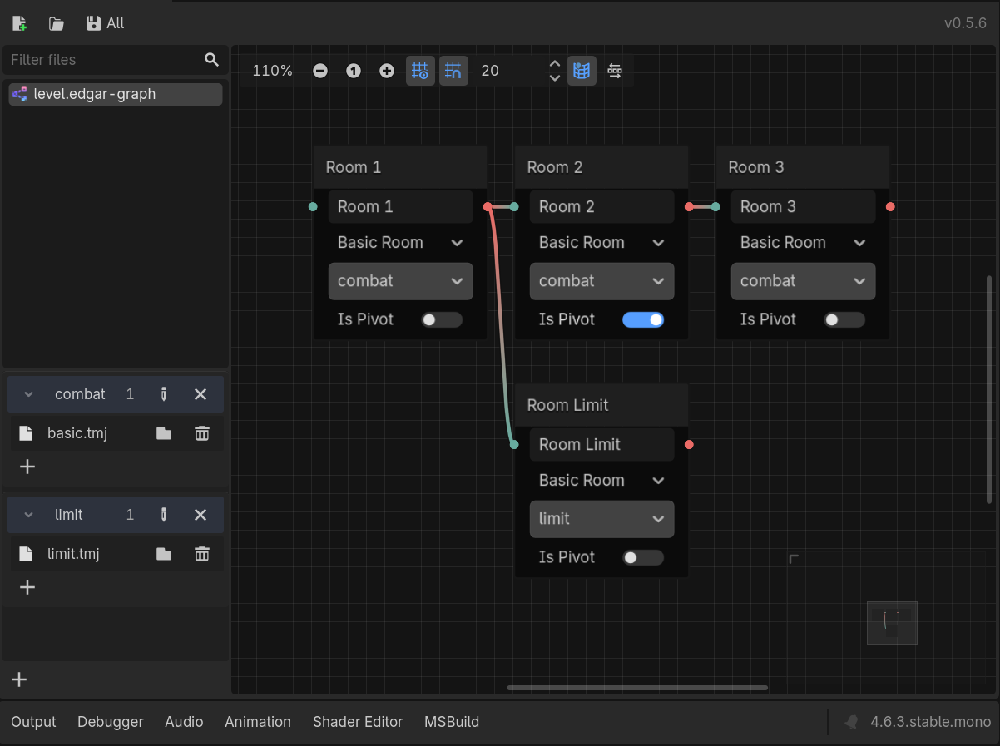
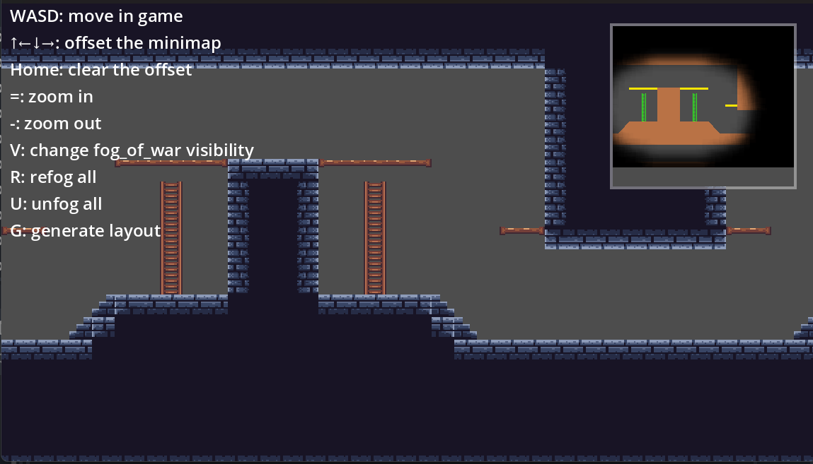

# Edgar.Godot

> [!CAUTION] 
> **WIP**: This project is currently under active development. Features and implementations are subject to change.

## Overview
`Edgar.Godot` is a GDScript toolkit that integrates the [Edgar-DotNet](https://github.com/OndrejNepozitek/Edgar-DotNet) procedural level generation algorithm into Godot. It converts Tiled maps and custom room graph resources into Godot-ready data for runtime Rogue-like dungeon assembly, with a replaceable kernel supporting both C# and GDExtension implementations.

Edgar.Godot consumes Tiled map files (`*.tmx` / `*.tmj`) and custom JSON graph resources (`*.edgar-graph`) that define room connectivity and metadata.

> [!IMPORTANT]
> [YATI](https://github.com/Kiamo2/YATI) is no longer needed as a separate addon — its runtime is now bundled via `preload`. The original YATI addon can coexist without conflict, and may be safely kept or removed.

> [!NOTE]
> Native Godot scene (`.tscn`) support as an alternative to Tiled room definitions is currently under design.  
>  
> Uses the C#/.NET types via [Edgar.Aot](https://github.com/RickyYCheng/Edgar.Aot); requires a .NET-enabled Godot build.  
>  
> For the native GDExtension version, see [Edgar.GDExtension](https://github.com/RickyYCheng/Edgar.GDExtension).  

## Core Features
- 🗺️ Converts [Tiled](https://www.mapeditor.org/) map files into Godot-compatible JSON resources, complete with metadata for procedural map generation. [YATI](https://github.com/Kiamo2/YATI) runtime is bundled — no separate addon installation needed.
- ⚙️ Custom `JSON` room graph format (`*.edgar-graph`) for defining room connectivity.
- 📝 **Visual Graph Editor**: Built-in editor for designing room graphs with layer-based room categorization and per-graph layer management.
- 🔄 Kernel Replaceability: Standardized interfaces that are compatible with both `C#` scripts and `GDExtension` versions.
- Generates Godot-friendly `Dictionary` layouts utilizing the Kernel's API.
- Includes a sample renderer for displaying generated maps on `TileMapLayer`.
- 🌑 **Fog of War (FOW)**: Dynamic visibility system that reveals explored areas while hiding unexplored regions.
- 🗺️ **Minimap**: Real-time minimap display for navigation and overview of generated dungeons.

> Edgar Designer

> Fog of War and Minimap demo

## Meta Reference
There are some already in-used fields in the Tiled map's `properties`.  
They are used to define the room's metadata for Edgar.  

This project bundles YATI runtime, so you can use YATI's custom properties (e.g. `godot_node_type`, `godot_group`) directly in Tiled. See [YATI's reference](https://github.com/Kiamo2/YATI/blob/main/Reference.md) for the full list.

For Edgar.Godot-specific fields, see [reference](addons/edgar.godot/reference.md).

## Quick Start
Please check the exmaples in the `examples/` folder.

## Roadmap
- [x] Runtime external loading for tmx/tmj files
  - [x] Remove bundled `YATI` addon version
- [ ] Godot Scene Support — Alternative to Tiled files for room definitions
  - [x] Add proxy support to customize loading procedures
  - [ ] Add `*.tscn/*.scn` support for main screen graph-edit
  - [ ] Add edgar extractor for godot scenes
  - [ ] Add godot scene proxy
- [ ] 3D Renderer Support — Integration with GridMap and other 3D tile systems
